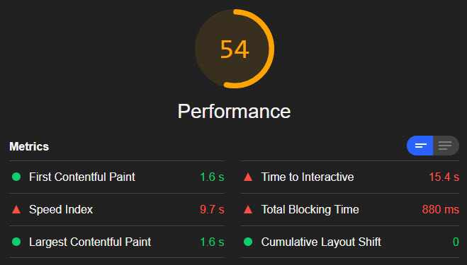
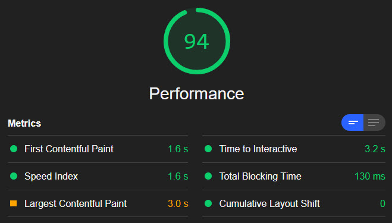

# `<iframe>` Lazy Loading without Javascript
<iframe> lazy loading with only HTML & CSS

## Method

- Add each `<iframe>` in the main HTML without a `SRC`. Use inline CSS background-image to add a cover image for the iframe.
- Add a unique iframe name, e.g. `name="iframe-1"`.
- Add an `<a>` link with a `HREF=` to the link to be embedded into the iframe.
- Add to the `<a>` element above `target="iframe-1"`.
- Add to the `<a>` element: `onclick="this.remove()"`. This will remove the button after a click/tap.
- Inside the `<a>` element add a button looking image or an SVG.

## Example

    

      <iframe  
        width="100%" height="100%" 
        title="Sweet Jonny Videos" 
        name="iframe-1" 
        frameborder="0" allowfullscreen 
        allow="accelerometer; autoplay; encrypted-media; gyroscope; picture-in-picture" 
        style="
        background-image:url('https://i.ytimg.com/vi_webp/tZgjknJwlgM/hqdefault.webp'); 
        background-repeat: no-repeat; background-size: contain; background-position: center;
        ">
      </iframe>
      <a title="Load Videos" 
        onclick="this.remove()" 
        href="https://www.youtube.com/embed/videoseries?list=PLTUAoPcp3g6GcwTlz9Qcaw4WcgnQpIgm3&autoplay=1" 
        target="iframe-1">
        <!-- SVG inline to allow interaction via CSS & <a> onclick 
             you can also use an  element, which is a one liner, less code -->
        <svg height="100%" width="100%" 
         <-- SGV content goes here, see full example in `index.html` -->
        </svg>
      </a>
    

    
Add CSS as necessary to make button to work as you like, see example in `iframe-lazy.css`.

## Performance Results

Comparison of performance with `lighthouse`:

** [Embed (no lazy loading)](https://soundspinning.github.io/iframe-lazy/iframe-no-lazy-load.html) **:

** [HTML & CSS lazy loading](https://soundspinning.github.io/iframe-lazy/) **:

## Notes

- When comparing performance on the links above in lighthouse or other tool, make sure to clear browser cache before each test, for a fair comparison.
- Images can be lazy loaded with the latest HTML addition: `loading="lazy"` in the `` tag, which soon should be implemented in all modern browsers.
- One drawback from this simple iframe loading implementation is that on mobile devices two taps will be required, due to `autoplay` policy rules.

---
